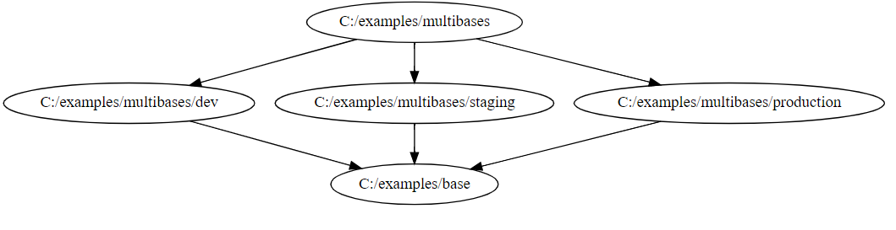
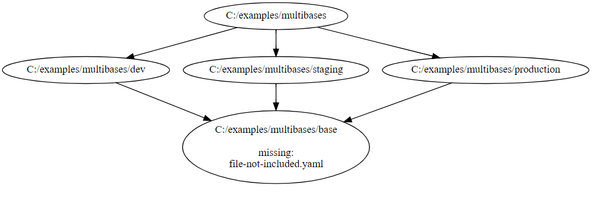

# kustomize-graph

[](https://goreportcard.com/report/github.com/jpreese/kustomize-graph)

`kustomize-graph` is a tool that will generate a dependency graph of your kustomize structure.

## Install

Builds are available on the [releases](https://github.com/jpreese/kustomize-graph/releases) page. 

## Usage

`kustomize-graph` outputs a graph in DOT. To visualize a DOT graph, [graphviz](https://graphviz.gitlab.io/download/) is recommended.

After installing, a graph can be generated by piping the output of kustomize-graph into DOT.

```
kustomize-graph | dot -Tsvg > graph.svg
```

**NOTE:** You should run `kustomize-graph` in the same working directory that you would run `kustomize` in.

## Example

### Multibases

Using the multibases example from the kustomize repository

> ```
> multibases
> ├── base
> │   ├── kustomization.yaml
> │   └── pod.yaml
> ├── dev
> │   └── kustomization.yaml
> ├── kustomization.yaml
> ├── production
> │   └── kustomization.yaml
> └── staging
>     └── kustomization.yaml
> ```


```yaml
# multibases/base/kustomization.yaml
resources:
- pod.yaml
```



**NOTE:**  While the folder structure that produced this graph contains a `pod.yaml` in the `base` directory, the generated graph will only show the folder. 

If only the folder is shown, it can be inferred that all `.yaml` files in the directory are defined in the `kustomization.yaml` file.

### Missing Resources

Taking the same example as above, if a file is **NOT** defined in `kustomization.yaml`, it is annotated in the node.

> ```
> multibases
> ├── base
> │   ├── kustomization.yaml
> │   ├── file-not-included.yaml
> │   └── pod.yaml
> ├── dev
> │   └── kustomization.yaml
> ├── kustomization.yaml
> ├── production
> │   └── kustomization.yaml
> └── staging
>     └── kustomization.yaml
> ```

```yaml
# multibases/base/kustomization.yaml
resources:
- pod.yaml
```

