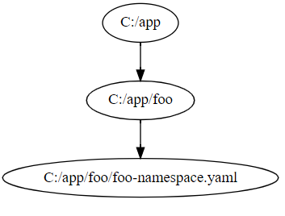

# kustomize-graph

[](https://goreportcard.com/report/github.com/jpreese/kustomize-graph)

kustomize-graph is a small application that will generate a dependency graph of your kustomize structure.

## Install

Builds are available on the [releases](https://github.com/jpreese/kustomize-graph/releases) page. 

## Usage

kustomize-graph outputs a graph in DOT. To visualize a DOT graph, [graphviz](https://graphviz.gitlab.io/download/) is recommended.

After installing, a graph can be generated by piping the output of kustomize-graph into DOT.

```
kustomize-graph | dot -Tsvg > graph.svg
```

NOTE: You should run kustomize-graph in the same working directory as you would run kustomize.

## Examples

### Simple

Given the following file structure

> ```
> ~/app
> ├── kustomization.yaml
> └── foo
>     ├── kustomization.yaml
>     └── foo-namespace.yaml
> ```

Would result in the following dependency graph



### Multibases

Another example using the multibases example from the kustomize repository

> ```
> .
> ├── base
> │   ├── kustomization.yaml
> │   └── pod.yaml
> ├── dev
> │   └── kustomization.yaml
> ├── kustomization.yaml
> ├── production
> │   └── kustomization.yaml
> └── staging
>     └── kustomization.yaml
> ```


